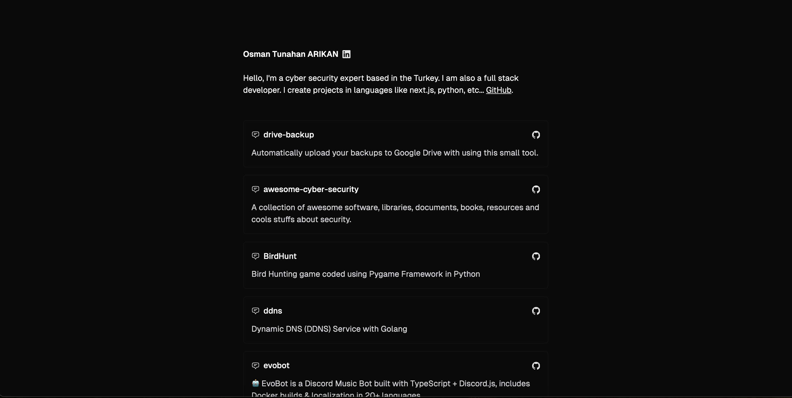

# Portfolio

Welcome to my portfolio project!

### Demo


### Getting Started
1. **Clone the repository:**
```bash
git clone https://github.com/OsmanTunahan/portfolio.git
cd portfolio
```

2. **Install dependencies:**
```bash
npm install
````

3. **Run the development server:**
```bash
npm run dev
```

4. **Build for production:**
```
npm run build
```

